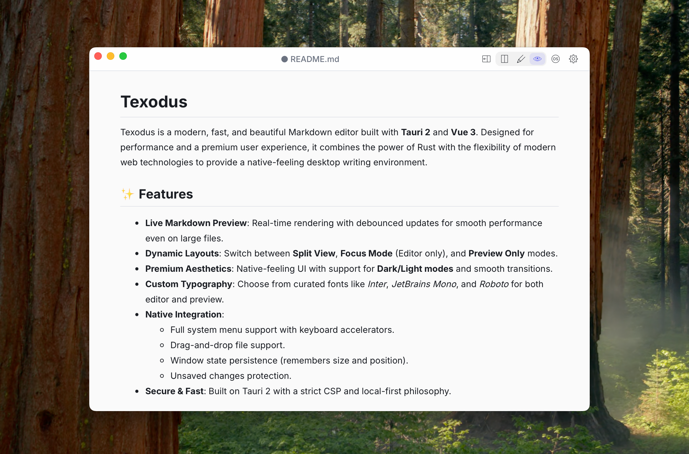
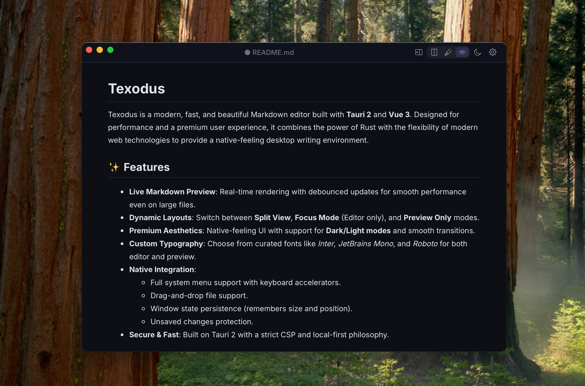

# Texodus

Texodus is a modern, fast, and beautiful Markdown editor built with **Tauri 2** and **Vue 3**. Designed for performance and a premium user experience, it combines the power of Rust with the flexibility of modern web technologies to provide a native-feeling desktop writing environment.



## ✨ Features

-   **Live Markdown Preview**: Real-time rendering with debounced updates for smooth performance even on large files.
-   **Dynamic Layouts**: Switch between **Split View**, **Focus Mode** (Editor only), and **Preview Only** modes.
-   **Premium Aesthetics**: Native-feeling UI with support for **Dark/Light modes** and smooth transitions.
-   **Custom Typography**: Choose from curated fonts like *Inter*, *JetBrains Mono*, and *Roboto* for both editor and preview.
-   **Native Integration**: 
    -   Full system menu support with keyboard accelerators.
    -   Drag-and-drop file support.
    -   Window state persistence (remembers size and position).
    -   Unsaved changes protection.
-   **Secure & Fast**: Built on Tauri 2 with a strict CSP and local-first philosophy.

## 📸 Gallery

### Preview Only Mode (light theme)


### Preview Only Mode (dark theme)


### Split View Mode


## 🛠️ Tech Stack

-   **Core**: [Tauri 2](https://v2.tauri.app/) (Rust)
-   **Frontend**: [Vue 3](https://vuejs.org/) (Composition API) + [Vite](https://vitejs.dev/)
-   **State**: [Pinia](https://pinia.vuejs.org/)
-   **Markdown**: [marked.js](https://marked.js.org/) with [DOMPurify](https://github.com/cure53/dompurify) for sanitization.
-   **Syntax Highlighting**: [Prism.js](https://prismjs.com/)
-   **Styling**: Vanilla CSS (no frameworks) with CSS variables for theming.
-   **Package Manager**: [Bun](https://bun.sh/) (recommended)

## 🚀 Getting Started

### Prerequisites

-   [Rust](https://www.rust-lang.org/tools/install) installed.
-   [Bun](https://bun.sh/) (preferred) or Node.js.
-   System-specific dependencies for Tauri (see [Tauri Prerequisites](https://v2.tauri.app/start/prerequisites/)).

### Installation

1.  Clone the repository:
    ```bash
    git clone https://github.com/w512/texodus.git
    cd texodus
    ```

2.  Install dependencies:
    ```bash
    bun install
    ```

3.  Run the development server:
    ```bash
    bun run tauri dev
    ```

## 📦 Building

To create a production-ready installer for your current platform:

```bash
bun run tauri build
```

## 🏗️ Project Structure

-   `src/`: Vue.js frontend source code.
    -   `components/`: Reusable Vue components.
    -   `stores/`: Pinia state management.
    -   `composables/`: Shared logic and native integrations.
    -   `services/`: Core application services (File I/O).
-   `src-tauri/`: Rust backend and Tauri configuration.
-   `docs/`: Project documentation and development plans.

## 📄 License

This project is licensed under the GNU General Public License v3 - see the [LICENSE](LICENSE.txt) file for details.
